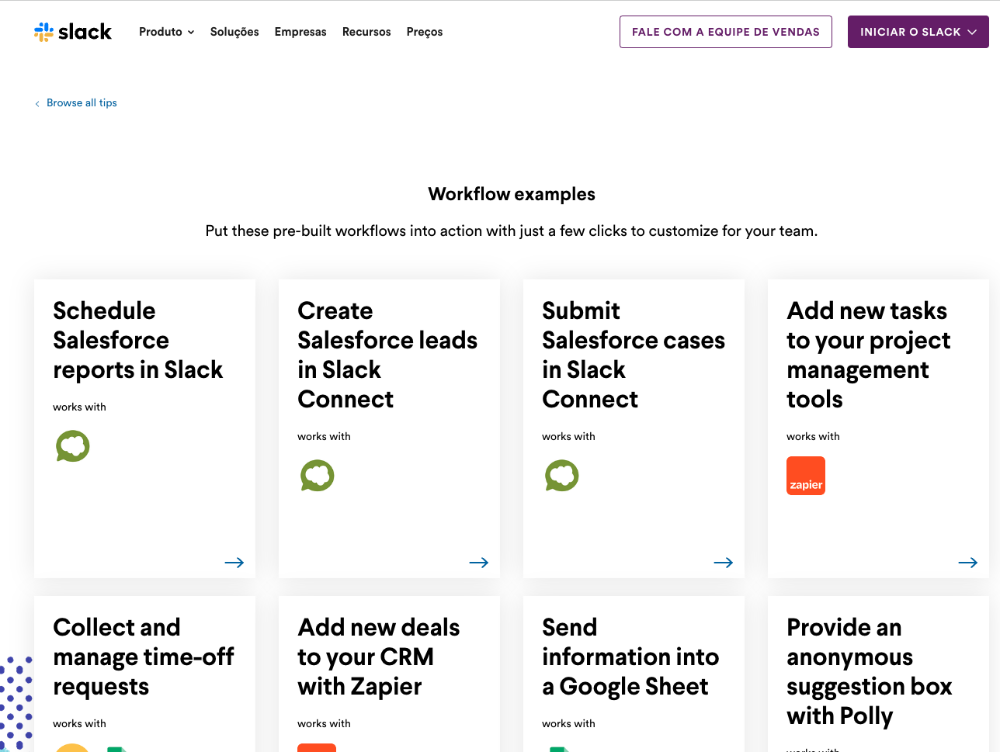
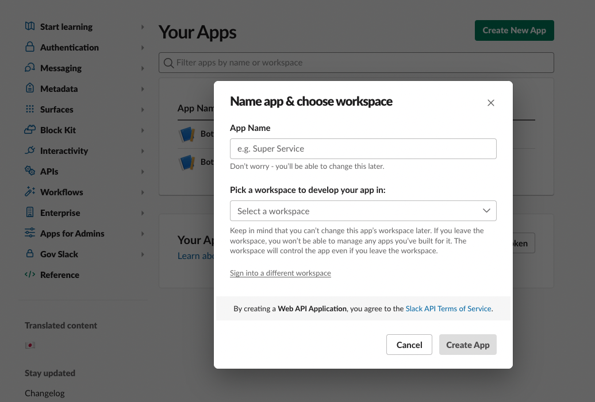

import { Head, Image, Appear } from 'mdx-deck'
import Code from 'mdx-code';
import { CodeSurfer } from "mdx-deck-code-surfer";

import { Cover } from './Cover';
import { Intro } from './Intro';
import { Roadmap } from './Roadmap';
import { Thanks } from './Thanks';
import { Feedback } from './Feedback';
import { Patreon } from './Patreon';
import { Social } from './Social';
import {Img} from './Img'

export { default as theme } from './theme'

<Head>
  <title>Improving Operational Work with a Slack Bot</title>
</Head>

<Cover />
---
<Intro />

---
## Overview

<Roadmap />

---
## Why

<ul>
    <Appear>
        <li>mainly communication channel</li>
        <li>operational worker</li>
        <li>daily routines</li>
        <li>make easier our life</li>
    </Appear>
</ul>

---

# Workflow Builder

---

# Workflow Builder

---

# Slack Bolt

<ul>
    <Appear>
        <li>The Bolt family of SDKs</li>
        <li>Bolt is the swiftest way to start programming with the Slack Platform in JavaScript, Python, or Java.</li>
        <li>Install your app using OAuth 2.0</li>
        <li>Receive real time events and messages with the Events API</li>
        <li>Compose rich, interactive messages with Block Kit</li>
        <li>Respond to slash commands, shortcuts, and interactive messages</li>
        <li>Use a wide library of Web API methods</li>
    </Appear>
</ul>

---

# Bolt Libs

---

# Bolt Js

<ul>
    <Appear>
        <li>NodeJS SDK</li>
        <li>Slack Web API</li>
        <li>Events API</li>
        <li>Webhooks</li>
        <li><a href='https://slack.dev/bolt-js/tutorial/getting-started'>https://slack.dev/bolt-js/tutorial/getting-started</a></li>
    </Appear>
</ul>

---

# Creating new App
<ul>
    <li>Manually </li>
    <li>Manifest</li>
</ul>

---

# Creating new App
<ul>
    <li>Manually</li>
</ul>

---

# Creating new App
<ul>
    <li>creating</li>
</ul>

---

# Creating new App
<ul>
    <li>filling it</li>
</ul>

---

# Creating new App
<ul>
    <li>filled</li>
</ul>

---

# Creating new App
<ul>
    <li>created</li>
</ul>

---

# Creating new App - Manifest
<ul>
    <li>yml</li>
    <li>faster</li>
    <li>plug n play</li>
</ul>

---

    <CodeSurfer
      title="Slack App yml"
      code={require('!raw-loader!./manifest.yml')}
      showNumbers={false}
      dark={true}
      lang="yml"
      steps={[
        { range: [1, 50], notes: 'manifest yml'},
        { range: [1, 2], notes: 'manifest display information'},
        { range: [3, 10], notes: 'manifest features'},
        { range: [11, 20], notes: 'manifest oauth'},
        { range: [21, 30], notes: 'manifest settings'},
      ]}
    />

---

    <CodeSurfer
      title="Slack Commands"
      code={require('!raw-loader!./slackCommand.ts')}
      showNumbers={false}
      dark={true}
      lang="typescript"
    />

---

    <CodeSurfer
      title="Slack Message obj"
      code={require('!raw-loader!./message.ts')}
      showNumbers={false}
      dark={true}
      lang="typescript"
    />

---

    <CodeSurfer
      title="Slack Say"
      code={require('!raw-loader!./slackSay.ts')}
      showNumbers={false}
      dark={true}
      lang="typescript"
    />

---
# Slack SDK
<ul>
    <Appear>
        <li><a href="https://api.slack.com/methods">https://api.slack.com/methods</a></li>
    </Appear>
</ul>

---

# Slack SDK
<ul>
    <li>Docs</li>
</ul>

---

    <CodeSurfer
      title="Slack SDK"
      code={require('!raw-loader!./slackSdk.ts')}
      showNumbers={false}
      dark={true}
      lang="typescript"
    />

---
# Slack API
<ul>
    <Appear>
        <li><a href="https://api.slack.com/docs">https://api.slack.com/docs</a></li>
    </Appear>
</ul>

---

# Slack API
<ul>
    <li>Docs</li>
</ul>

---

# Slack Block Kit Builder
<ul>
    <li><a href='https://app.slack.com/block-kit-builder/'>Block Kit Builder</a></li>
</ul>

---

# Examples
<ul>
    <Appear>
        <li>timeout</li>
        <li>cron</li>
        <li>daily thread</li>
        <li>diff</li>
    </Appear>
</ul>

---

    <CodeSurfer
      title="Timeout"
      code={require('!raw-loader!./timeout.ts')}
      showNumbers={false}
      dark={true}
      lang="typescript"
    />

---

    <CodeSurfer
      title="Cron"
      code={require('!raw-loader!./cron.ts')}
      showNumbers={false}
      dark={true}
      lang="typescript"
    />

---

    <CodeSurfer
      title="Daily Thread"
      code={require('!raw-loader!./dailyThread.ts')}
      showNumbers={false}
      dark={true}
      lang="typescript"
    />

---

# Daily Thread Challenges
<ul>
  <li>get users id</li>
  <li>check if each one answered the thread</li>
  <li>remind</li>
  <li>blocks</li>
</ul>

---

    <CodeSurfer
      title="Diff"
      code={require('!raw-loader!./diff.ts')}
      showNumbers={false}
      dark={true}
      lang="typescript"
      steps={[
        { range: [1, 13], notes: 'diff message'},
        { range: [15, 80], notes: 'get diff'},
        { range: [16, 19], notes: 'params' },
        { range: [21, 23], notes: 'octokit auth'},
        { range: [25, 41], notes: 'latest release tag'},
        { range: [43, 80], notes: 'lastest release tag'},
      ]}
    />

---

# Diff Challenges
<ul>
  <li>improve dx</li>
  <li>improve blocks</li>
  <li>release button</li>
</ul>

---

# Contributing
<ul>
  <li>clone the repo</li>
  <li>fill with tokens</li>
  <li>install in your slack app</li>
</ul>

---

# Tokens
<ul>
  <li>to develop based in this bot you will need 3 tokens</li>
  <li>signing token</li>
  <li>app token</li>
  <li>bot token</li>
</ul>

---

# Signing Token
<ul>
  <li>get it on basic information</li>
  <li>go to App Credentials</li>
  <li>In Signing Secret click on show and copy the token</li>
</ul>

---

# Signing Token

---

# App Token
<ul>
  <li>start with xoxb</li>
  <li>got to <a href='https://api.slack.com/apps/'>https://api.slack.com/apps/</a></li>
  <li>Select your ap then on sidebar go to OAuth & Permissions </li>
</ul>

---

# App Token

---

# Bot Token
<ul>
  <li>start with xapp</li>
  <li>generated manually</li>
  <li>App-level tokens allow your app to use platform features that apply to multiple (or all) installations</li>
  <li>App-level tokens are used to authenticate your app to the platform</li>
  <li>In basic information section go to App-Level Tokens</li>
  <li>Create a new app level token to your bot and copy the value</li>
</ul>

---

# Bot Token

---

# Bot Token

---

# Bot Token

---

    <CodeSurfer
      title="Final Result"
      code={require('!raw-loader!./bot.ts')}
      showNumbers={false}
      dark={true}
      lang="typescript"
      steps={[
        { range: [1, 107], notes: 'diff message'},
        { range: [20, 25], notes: 'configuring bot app'},
        { range: [27, 28], notes: 'id stuff' },
        { range: [30, 37], notes: 'listen and post a message'},
        { range: [39, 48], notes: 'list a bot message and set a timout'},
        { range: [50, 52], notes: 'find a conversation and reply'},
        { range: [54, 63], notes: 'timeout and message example'},
        { range: [65, 67], notes: 'get user information example'},
        { range: [69, 80], notes: 'cron example'},
        { range: [82, 91], notes: 'diff example'},
        { range: [96, 100], notes: 'turning on the app'},
      ]}
    />

---

# References

- <a href="https://slack.dev/">https://slack.dev/</a>
- <a href="https://slack.dev/bolt-js/tutorial/getting-started">https://slack.dev/bolt-js/tutorial/getting-started</a>
- <a href="https://api.slack.com/authentication/basics">https://api.slack.com/authentication/basics</a>
- <a href="https://slack.dev/node-slack-sdk/">https://slack.dev/node-slack-sdk/</a>
- <a href="https://app.slack.com/block-kit-builder/">https://app.slack.com/block-kit-builder/</a>

---
<Patreon />

---
<Social/>

---
<Feedback />

---
<Thanks />
